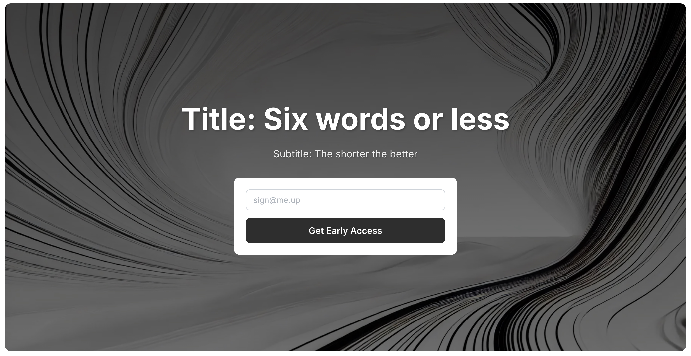

# 

<h1 align="center">Idea(L)anding Page V1</h1>

An open source, full stack, product-minded starter kit for going from idea-to-vetted product based on ongoing learnings from [dkBuilds](https://www.declankramper.me) projects.

<p align="center">
  <a href="#">Website</a> · 
  <a href="#whats-included">What's Included</a> · 
  <a href="#prerequisites">Prerequisites</a> · 
  <a href="#getting-started">Getting Started</a> · 
  <a href="#how-to-use">How to use</a> · 
  <a href="#roadmap">Roadmap</a>
</p>

Everything you need to build a production-ready SaaS, but more importanty, vet your idea. It's an oppinionated starter based on **my own learnings** with a focus on solving your problem to **decide what to build**.

## What's Included
- [Coming soon](#)


## Directory Structure

```bash
.
├── Coming soon         # App workspace
└── README.md           # This README file #
```

## Prerequisites


## Getting Started


## How to use


## Roadmap


## Recognition


## Contact

