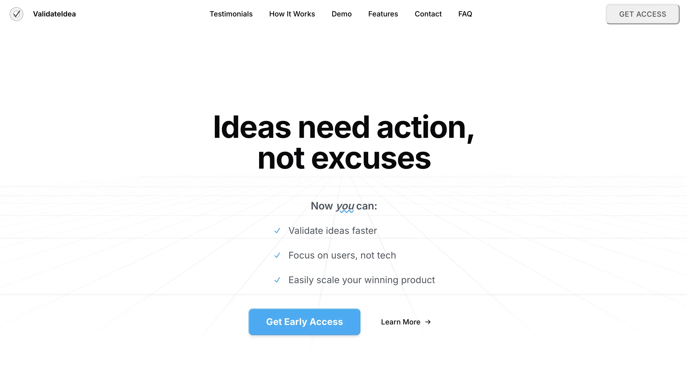

# 

<h1 align="center">ValidateIdea.now (V1)</h1>

An open source, full stack, product-minded starter kit for going from idea-to-vetted live product based on ongoing learnings from [dkBuilds](https://www.declankramper.me) projects. Read the complete project guide [here](https://www.notion.so/declankamper/validateidea-now-guide), or continue reading below to setup your project.

<p align="center">
  <a href="https://www.validateidea.now">Website</a> · 
  <a href="#whats-included">What's Included</a> · 
  <a href="#prerequisites">Prerequisites</a> · 
  <a href="#getting-started">Getting Started</a> · 
  <a href="#how-to-use">How to use</a> · 
  <a href="#roadmap">Roadmap</a>
</p>

**Everything you need** to build a production-ready SaaS, but more importanty, **vet your idea**. It's an oppinionated starter based on **my own learnings** with a unique focus on solving your problem of **deciding what to build** by allowing you to **quickly launch a landing page** and **analyze what your users are excited about**.


## What's Included

**Framework**: [Next.js](https://nextjs.org/) with Typescript
**Styling:** [TailwindCSS](https://tailwindcss.com/) | CSS modules
**UI component library:** [Shadcn](https://ui.shadcn.com/)  | [Mantine](https://mantine.dev/)
**Advanced components:** [MagicUI](https://magicui.design/)
**Animations library:** [Framer motion](https://www.framer.com/)
**Hosting / Deployment:** [Vercel](https://vercel.com/) 
**Database (serverless):** [Supabase](https://supabase.com/) 
**Analytics:** [Amplitude](https://amplitude.com/) ([PostHog](https://posthog.com/) | [OpenPanel](https://openpanel.dev/) coming soon) 
**Email delivery**: [Resend](https://resend.com/)
**Email templates**: [React Email](https://react.email/)
**Links**: [dub.co](http://dub.co) 
**Payments**: [Stripe](https://stripe.com/)
**LLM:** [OpenAI API](https://openai.com/api/)
**Authentication:** [NextAuth](https://next-auth.js.org/) (Auth.js) or [Supabase Auth](https://supabase.com/docs/guides/auth)


## Beauty of this stack
**Simple & configurable** 
- pages router instead of app router
- to connect to external services, just add your variables in .env.local
- drag and drop components in /src/sections to create your landing page

**Built to validate** 
- product-led signup flow
- analyze interest with supabase and amplitude
- pre-configured components to sell your idea


## Prerequisites
Before you begin, ensure you have the following installed:
- [Node.js](https://nodejs.org/) (v18.17 or higher)
- [pnpm](https://pnpm.io/) (v8.0 or higher) - Recommended for faster, more efficient package management
- [Supabase](https://supabase.com/) account for the database
- [Vercel](https://vercel.com/) account for deployment
- [Resend](https://resend.com/) account for email delivery
- [Amplitude](https://amplitude.com/) account for analytics


## Getting Started
## Getting Started

1. **Clone the repository**
   ```bash
   git clone https://github.com/yourusername/validateidea.now.git
   cd validateidea.now
   ```

2. **Install dependencies**
   ```bash
   pnpm install
   ```

3. **Set up environment variables**
   ```bash
   cp .env.example .env.local
   ```
   Then, fill in your environment variables:
   ```env
   # Supabase
   NEXT_PUBLIC_SUPABASE_URL=your-supabase-url
   NEXT_PUBLIC_SUPABASE_ANON_KEY=your-supabase-anon-key

   # Analytics (Optional)
   NEXT_PUBLIC_AMPLITUDE_API_KEY=your-amplitude-key
   ```

4. **Set up Supabase tables**
   Create the following tables in your Supabase dashboard:
   - `signups`: For collecting email signups
   - `contacts`: For contact form submissions
   
   Schema details are provided in the `/supabase` directory.

5. **Run the development server**
   ```bash
   pnpm dev
   ```
   Visit [http://localhost:3000](http://localhost:3000) to see your landing page.

6. **Customize your landing page**
   - Update copy and configuration in `/src/components/sections`
   - Modify themes in `/src/styles`

7. **Deploy to Vercel**
   ```bash
   pnpm vercel deploy
   ```


## How to use
This boilerplate is inspired by my ongoing web development projects and struggle to decide what to build, so it's designed to serve as a reference for real-world software apps. Feel free to dive into the code and see how I've tackled various features. Whether you're looking to understand design systems, database interactions, analytics, email handling, or UI components, you'll find practical, configurable implementations throughout the codebase. It's not just a starting point; it's a learning resource that can help you build your own applications.

With this, you have a great starting point for your own project.


## Directory Structure

```bash
your-project/        
├── public/                    
│   ├── backgrounds/           # Background images
│   │   ├── HeroBackgroundWaves.webp
│   │   └── ...
│   │
│   ├── icons/                 # Small SVGs or icon assets
│   │   ├── favicon.ico        # Favicon for the website
│   │   └── ...
│   │
│   ├── images/                # General images for the project
│   │   └── ...
│   │
│   ├── logos/                 # Logos for branding, partners, etc.
│   │   ├── ProjectLogo.webp
│   │   └── ...
│
├── src/                       
│   ├── components/            # Modular, reusable UI components
│   │   ├── ui/                # Shadcn/UI (+MagicUI) base components
│   │   │   ├── button.tsx     
│   │   │   ├── card.tsx       
│   │   │   └── ...
│   │   │
│   │   ├── layout/            # Layout components
│   │   │   ├── Header/        
│   │   │   ├── Footer/        
│   │   │   └── ...
│   │   │
│   │   ├── sections/          # Landing page sections
│   │   │   ├── HeroSection/   
│   │   │   ├── FeaturesSection/  
│   │   │   └── ...
│   │   │
│   │   └── shared/            # Shared utilities & smaller components
│   │       ├── signup-modal/  
│   │       └── ...
│   │
│   ├── styles/
│   │   ├── globals.css        # Global styles
│   │   ├── theme.ts           # Mantine theme
│   │   ├── fonts/             # Optional fonts
│   │   └── components/        # Component-specific CSS modules
│   │       ├── Header.module.css
│   │       ├── Features.module.css
│   │       └── ...
│   │
│   ├── hooks/                 # Custom React hooks
│   │   ├── use-toast.ts       
│   │   └── ...
│   │
│   ├── pages/                 # Next.js pages
│   │   ├── _app.tsx           # App configuration with providers
│   │   ├── _document.tsx      # Document level customization
│   │   ├── index.tsx          # Main entry point (serves LandingPage.tsx)
│   │   └── LandingPage.tsx    # Main component for content structure
│   │
│   └── lib/                   # Utilities & configurations
│       ├── utils.ts           # Helper functions
│       ├── analytics/         # Analytics integrations
│       └── supaBaseClient.ts  # Supabase database client configuration
│
├── .env.local                 # Local environment variables
├── README.md                  # This README file
├── components.json            # Index for shadcn/UI components
└── tailwind.config.ts         # Tailwind CSS configuration
```

## Roadmap
- simplify everything
- decision Y/N: switch to app router (currently = pages router)
- dark mode
- authentication
- stripe payments
- advanced product analytics with simplified web analytics - using OpenPanel/PostHog
- LLM integration for your AI apps (OpenAI)
- more components

## Contact
- [email](mailto:declankramper@gmail.com)
- [linkedin](https://www.linkedin.com/in/declankramper/)
- [portfolio](https://www.declankramper.me)
- [x/twitter](https://x.com/asbestostrades)

## Recognition
[Product Hunt](https://www.producthunt.com/@declan_kramper)


